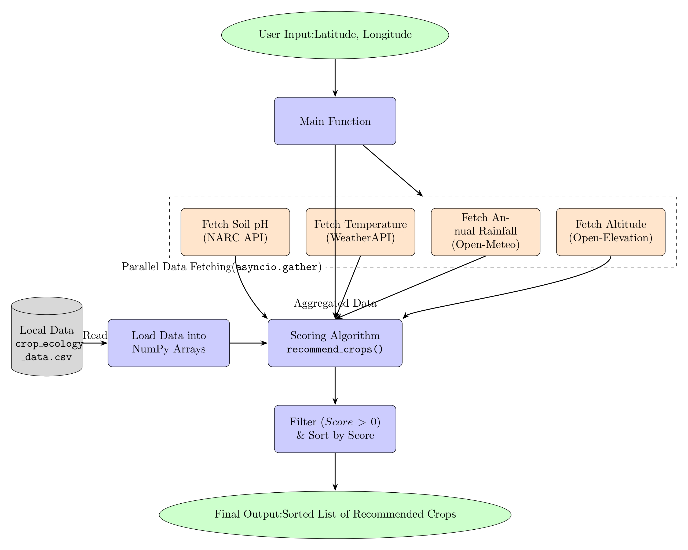

# 🌾 Hamikissan - AI-Powered Agricultural Platform

**Hamikissan** is a comprehensive agricultural platform that leverages AI to help farmers with crop recommendations, disease detection, weather forecasting, and marketplace functionality. The platform supports both Hindi and English languages and provides voice-powered navigation.

## 🚀 Features

### Core Functionality
- **🌱 Crop Recommendation**: AI-powered crop suggestions based on location, soil, and weather data
- **🔍 Disease Detection**: Image-based plant disease identification with detailed solutions
- **🌤️ Weather Forecasting**: Real-time weather alerts and forecasts for agricultural planning
- **🗺️ Interactive Maps**: Disease alerts visualization and location-based services
- **🎤 Voice Navigation**: Hindi/English voice commands for hands-free navigation
- **🏪 Marketplace**: Buy and sell agricultural products with voice-powered listings

### Technical Features
- **AI Integration**: Google Gemini AI for intelligent responses and analysis
- **Speech Recognition**: Faster-Whisper for Hindi/English transcription
- **Real-time Data**: Weather APIs and soil data integration
- **Responsive Design**: Modern UI with mobile-first approach
- **Database Integration**: Supabase for data persistence and real-time updates

## 🏗️ Architecture

The project follows a full-stack architecture with separate frontend and backend services:

```
Team-QuBits/
├── fe/                    # React Frontend (Vite)
├── be/                    # FastAPI Backend
├── Workflowdig/          # System Architecture Diagrams
└── README.md
```

## 📋 Prerequisites

Before running the application, ensure you have:

- **Node.js** (v18 or higher)
- **Python** (v3.8 or higher)
- **Git**
- **Google AI API Key** (for Gemini AI)
- **Supabase Account** (for database)

## 🛠️ Installation & Setup

### 1. Clone the Repository

```bash
git clone https://github.com/your-username/Team-QuBits.git
cd Team-QuBits
```

### 2. Backend Setup

```bash
# Navigate to backend directory
cd be

# Create virtual environment
python -m venv venv

# Activate virtual environment
# On Windows:
venv\Scripts\activate
# On macOS/Linux:
source venv/bin/activate

# Install dependencies
pip install -r requirements.txt

# Create .env file
touch .env
```

### 3. Environment Variables

Create a `.env` file in the `be/` directory with the following variables:

```env
SUPABASE_URL=your_supabase_url
SUPABASE_SERVICE_ROLE=your_supabase_service_role_key
GOOGLE_API_KEY=your_google_gemini_api_key
```

### 4. Frontend Setup

```bash
# Navigate to frontend directory (from project root)
cd fe

# Install dependencies
npm install
```

## 🚀 Running the Application

### Development Mode

#### Start Backend Server
```bash
# From be/ directory
cd be
python -m uvicorn app:app --reload --host 0.0.0.0 --port 8000
```

#### Start Frontend Server
```bash
# From fe/ directory (in a new terminal)
cd fe
npm run dev
```

The application will be available at:
- **Frontend**: http://localhost:5173
- **Backend API**: http://localhost:8000
- **API Documentation**: http://localhost:8000/docs

### Production Deployment

#### Backend Deployment
```bash
# Install production dependencies
pip install gunicorn

# Run with Gunicorn
gunicorn -w 4 -k uvicorn.workers.UvicornWorker app:app --bind 0.0.0.0:8000
```

#### Frontend Deployment
```bash
# Build for production
npm run build

# Serve with a static server
npm install -g serve
serve -s dist -l 3000
```

## 📊 System Workflow

### 1. Crop Recommendation Workflow


The crop recommendation system analyzes:
- Location coordinates (latitude/longitude)
- Soil pH levels
- Weather conditions
- Rainfall data
- Altitude information

### 2. Disease Detection Workflow


The disease detection process:
- Upload plant image
- AI model analyzes the image
- Identifies disease type
- Provides detailed solutions and organic treatments
- Stores detection data for community alerts

### 3. Weather Alert System


Weather forecasting includes:
- Real-time weather data
- Multi-day forecasts
- Agricultural alerts
- Location-based recommendations

### 4. Voice-Powered Marketplace


Voice navigation features:
- Hindi/English speech recognition
- Voice-to-text conversion
- AI-powered intent detection
- Seamless page navigation

## 🔧 API Endpoints

### Core Endpoints

| Endpoint | Method | Description |
|----------|--------|-------------|
| `/Crop_recommendation` | GET | Get crop recommendations based on location |
| `/disease_detection/` | POST | Detect plant diseases from images |
| `/disease_detection_detailed/` | POST | Get detailed disease information and solutions |
| `/transcribe` | POST | Convert voice to text and extract crop data |
| `/transcribe/Findpage` | POST | Voice navigation to different pages |
| `/weatherforecast` | POST | Get weather forecasts and alerts |
| `/dashboard/data/` | GET | Get dashboard data (weather, soil, etc.) |
| `/Crop_info` | GET | Get detailed crop information |

### Example API Usage

#### Crop Recommendation
```bash
curl "http://localhost:8000/Crop_recommendation?lat=27.7172&lon=85.3240"
```

#### Disease Detection
```bash
curl -X POST "http://localhost:8000/disease_detection/" \
  -F "image=@plant_image.jpg" \
  -F "lat=27.7172" \
  -F "lon=85.3240"
```

## 🗄️ Database Schema

The application uses Supabase with the following main tables:

- **disease_detected**: Stores disease detection records with location data
- **users**: User authentication and profile information
- **listings**: Marketplace product listings

## 🧪 Testing

### Backend Testing
```bash
cd be
python -m pytest tests/
```

### Frontend Testing
```bash
cd fe
npm test
```

## 📱 Mobile Support

The application is fully responsive and works on:
- Desktop browsers
- Mobile devices
- Tablets
- Progressive Web App (PWA) capabilities

## 🌐 Internationalization

- **Languages**: Hindi and English
- **Voice Support**: Both languages supported
- **UI**: Responsive design for different screen sizes

## 🤝 Contributing

1. Fork the repository
2. Create a feature branch (`git checkout -b feature/amazing-feature`)
3. Commit your changes (`git commit -m 'Add some amazing feature'`)
4. Push to the branch (`git push origin feature/amazing-feature`)
5. Open a Pull Request

## 📄 License

This project is licensed under the MIT License - see the [LICENSE](LICENSE) file for details.

## 🆘 Troubleshooting

### Common Issues

#### Backend Issues
```bash
# If port 8000 is already in use
python -m uvicorn app:app --reload --port 8001

# If dependencies fail to install
pip install --upgrade pip
pip install -r requirements.txt --no-cache-dir
```

#### Frontend Issues
```bash
# Clear npm cache
npm cache clean --force

# Delete node_modules and reinstall
rm -rf node_modules package-lock.json
npm install
```

#### Environment Variables
- Ensure all required environment variables are set
- Check Supabase connection and API keys
- Verify Google AI API key permissions

## 📞 Support

For support and questions:
- Create an issue in the GitHub repository
- Check the API documentation at `/docs` endpoint
- Review the troubleshooting section above

## 🎯 Roadmap

- [ ] Mobile app development
- [ ] Advanced AI model training
- [ ] Multi-language support expansion
- [ ] Integration with IoT sensors
- [ ] Blockchain-based marketplace
- [ ] Advanced analytics dashboard

---

**Made with ❤️ by Team QuBits**
**Team Members :- Immense Raj Subedi, Ananta Pokhrel, Shital Gautam **